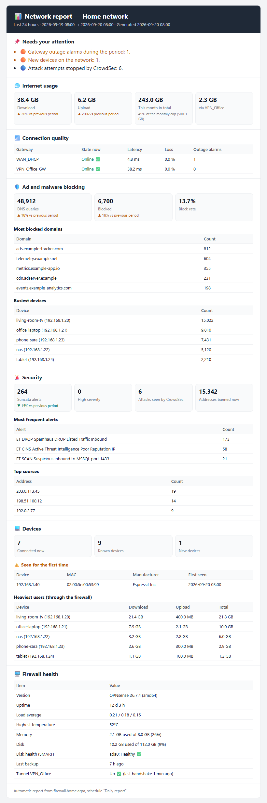
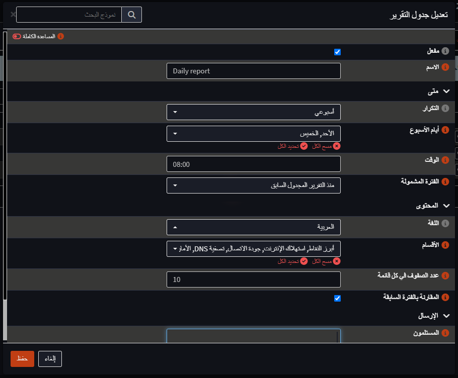

# Network Report for OPNsense

A plugin that emails a summary of your network on a schedule: how much data went through the
internet connection, whether the gateways dropped, what the DNS blocklists caught, what the IDS
saw, which devices were busiest, and how the firewall itself is doing.

I wanted something I could read over coffee instead of opening five pages of the GUI every
morning, so the report is a single HTML mail with the things that need attention at the top.

Tested on OPNsense 26.7.



*A daily report (sample data).*

## What is in a report

- **Needs attention**: gateway down or losing packets, outage alarms, new devices, high severity
  IDS alerts, temperature or disk above a threshold, SMART problems, an old configuration
  backup, the monthly data cap getting close.
- **Internet usage**: download and upload for the period, month to date, traffic through VPN
  tunnels, compared with the previous period.
- **Connection quality**: state, latency and loss of each monitored gateway, outage alarms in
  the period.
- **DNS filtering**: queries, blocked queries, most blocked domains, busiest clients.
- **Security**: Suricata alerts by signature and source, CrowdSec alerts and active bans.
- **Devices**: devices online, devices seen for the first time (with the manufacturer), and the
  heaviest users.
- **Firewall health**: version, uptime, load, temperature, memory, disk, SMART, last backup,
  VPN tunnel state.

Each schedule picks which of these sections it includes.

## Features

- Any number of schedules: daily, on selected weekdays, or on a day of the month (including the
  last day). Each has its own time, period, language, sections and recipients.
- The period defaults to "since the previous scheduled report", so nothing is counted twice.
  Fixed periods (24 hours, 7 days, 30 days, previous calendar month, month to date) are also
  available.
- Reports in all 21 languages of the OPNsense GUI, or in whatever language the GUI is set to.
  Arabic and Persian reports are laid out right to left.
- Optional "only when something needs attention" mode, which skips quiet days.
- A short alert within five minutes when a device joins the LAN for the first time.
- If the firewall is off at the scheduled time, the report goes out when it comes back (up to
  12 hours late).
- Preview and "send now" buttons, a history of everything sent, and copies of sent reports kept
  on the firewall for a configurable number of days.
- Mail goes through the SMTP server already configured for Monit, or a separate one.

## Screenshots

The GUI below is shown in Arabic, with the right-to-left layout from
[opnsense-rtl](https://github.com/AbdelmonemAwad/opnsense-rtl); in English it is laid out the usual way.

| Schedules | Editing a schedule |
| --- | --- |
|  |  |

The same report in Arabic: [docs/report-ar_SA.png](docs/report-ar_SA.png).

## Where the data comes from

The plugin does not collect anything itself; it reads what OPNsense already records. Sections
whose source is missing simply show "no data".

| Section | Source | Needed |
| --- | --- | --- |
| Internet usage | vnstat | `os-vnstat` plugin |
| Connection quality | dpinger gateway monitoring, system log | gateway monitoring enabled |
| DNS filtering | Unbound query database | Unbound with reporting enabled |
| Security | Suricata `eve.json`, `cscli` | Intrusion Detection, `os-crowdsec` (optional) |
| Devices | ARP table, host discovery, NetFlow | Insight (NetFlow) for per-device usage |
| Firewall health | sysctl, `smartctl`, system log | `os-smart` for SMART (optional) |

## Installation

The plugin is not in the OPNsense plugin repository yet, so there is no
`pkg install os-netreport`. There is a package, and you build it — on the firewall,
from this repository, in one command. Building needs no root and installs nothing.

```sh
fetch -o /tmp/netreport.tar.gz https://github.com/AbdelmonemAwad/os-netreport/archive/refs/heads/main.tar.gz
tar -xzf /tmp/netreport.tar.gz -C /tmp
cd /tmp/os-netreport-main
sh tools/make-package.sh -o /tmp -c net
```

It tells you where it put the package, its digest, and which commit it came from:

```
/tmp/os-netreport-1.0.pkg
SHA256 fa87eefb3acd9c1d2094e00e7816a84ae2f52804fb5c195cecea9f64b5f1c417
commit 3ba5f0ad1
built on OPNsense 26.7 amd64
```

The digest is of the file you just built. Two builds of the same commit do not
produce the same digest unless the commit date is passed in, because otherwise every
file in the archive carries its own mtime:

```sh
SOURCE_DATE_EPOCH=$(git log -1 --format=%ct) sh tools/make-package.sh -o /tmp
```

Read it before you install it. Nothing about a package file makes it trustworthy, and both of
these questions are answered out of the file itself, without touching the machine:

```sh
pkg info -F  /tmp/os-netreport-1.0.pkg    # version, licence, dependencies, description
pkg info -lF /tmp/os-netreport-1.0.pkg    # every file it will write, and it writes no others
```

Then, as root:

```sh
pkg add /tmp/os-netreport-1.0.pkg
```

Then open **Reporting → Network Report**, check the mail settings on the Settings tab
(the *Save and send test message* button is the quickest way), and add a schedule.

A newer version goes on over an installed one with `pkg add -f`. Settings in `config.xml` and
state under `/var/db` survive, because pkg replaces only the files the package owns.

<details>
<summary>Installing by hand instead, with no package</summary>

`install/install.sh` does the same work and is what existed before there was a package:

```sh
fetch -o /tmp/netreport.tar.gz https://github.com/AbdelmonemAwad/os-netreport/archive/refs/heads/main.tar.gz
tar -xzf /tmp/netreport.tar.gz -C /root
sh /root/os-netreport-main/install/install.sh
```

The difference is only in the bookkeeping: pkg does not know the files are there, so
`opnsense-version -c os-netreport` answers *not installed* on a machine where the plugin is
running, and removal is `install/uninstall.sh` rather than `pkg delete`.

</details>

### Removing it

```sh
pkg delete os-netreport
```

Settings stay in `config.xml` and the history in `/var/db/netreport`, so a reinstall
picks up where it left off.

### What a package outside the OPNsense repository does not get

It is not upgraded by **System → Firmware → Updates**, because that only offers what the
OPNsense repository carries, and this is not in it. A firmware update does not remove it —
the files are pkg's, and OPNsense does not delete packages it did not install — but it will
not be updated either. Build a new package from a newer tag and `pkg add -f` it.

## How it works

- `src/opnsense/scripts/netreport/netreport.py` builds and sends the reports. Cron runs it every
  minute (`/usr/local/etc/cron.d/netreport`); it sends whatever is due and scans the LAN for new
  devices every five minutes.
- The GUI (model, controllers, view) follows the usual OPNsense MVC layout. Settings are stored
  under `OPNsense/NetReport` in `config.xml`.
- Report texts live in `i18n/<locale>.json`. GUI strings for languages other than English are
  in `i18n/ui/<locale>.json` and are merged into the system catalogs by
  `merge_ui_translations.py`, which also runs at boot because core updates replace those
  catalogs. Once the plugin is part of the official repository this step goes away, since its
  strings would then be translated through the normal OPNsense process.
- State, history and archived reports are kept in `/var/db/netreport`.

## Translations

English and Arabic are complete and in daily use. The other languages are first versions and
would benefit from a native speaker's review; corrections are welcome as pull requests.
`install/check_i18n.py` checks that every language file has the same keys and placeholders as
the English one.

## Known limitations

- Per-device usage only covers traffic that passes through the firewall; traffic between two
  devices on the same switch is not seen.
- The "new device" list relies on the ARP table, so devices that are only on IPv6 are not
  detected.
- Some languages change word forms with the number (Polish, Russian, Ukrainian and others).
  The wording was chosen to read well for most numbers, but not every count is grammatically
  perfect.

## License

BSD 2-Clause, the same as OPNsense. See [LICENSE](LICENSE).
